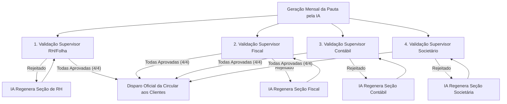

# Manual Oficial do Usuário &bull; Contatur Sentinel v3.5

> **Plataforma Corporativa de Inteligência Preventiva, Monitoramento de E-mails, Circulares Legislativas por IA e Integração com SGC & Contatur Meeting**  
> *Grupo Contatur: Contatur São Paulo &bull; Contatur Rio &bull; MKP São Paulo*

---

## 1. Visão Geral do Sistema

O **Contatur Sentinel** é a solução definitiva de monitoramento contínuo, governança relacional e inteligência estratégica do Grupo Contatur. Conectado diretamente aos servidores de e-mail corporativos (**Microsoft 365** e **Google Workspace**) e integrado ao **SGC** e **Contatur Meeting**, o sistema antecipa riscos, previne cancelamentos contábeis, equaliza a carga de trabalho dos analistas e dispara circulares legislativas mensais validadas por supervisores.

### 🏢 Arquitetura Multi-Tenant com Segmentação de Carteira
O sistema atende de forma nativa e isolada às 3 empresas do Grupo, adaptando sua inteligência ao perfil de negócio de cada unidade:
1. **Contatur São Paulo** (`contatur_sp`): Foco em **Turismo, Hotelaria, Eventos, PERSE e Retenções no Exterior**.
2. **Contatur Rio** (`contatur_rj`): Foco em **Turismo, Hotelaria, Gastronomia, Eventos e Legislação ISS-RJ**.
3. **MKP São Paulo** (`mkp_sp`): Foco em **Indústria, Comércio Geral, Importação/Exportação, Lucro Real/Presumido, ICMS-ST e Bloco K**.

> [!IMPORTANT]
> **Privacidade & Isolamento:** Cada colaborador acessa estritamente os dados da sua empresa de lotação. Somente o SuperAdmin Global (`edson@contatur.com.br`) possui visão unificada e consolidada das 3 empresas.

---

## 2. Controle de Acesso & Matriz de Permissões (RBAC)

O sistema conta com gestão granular de acessos em **`/usuarios`**, onde é possível habilitar ou desabilitar permissões tela a tela:

| Perfil | Nível de Acesso | Responsabilidades Principais |
|---|---|---|
| **SuperAdmin** | Global (3 Unidades) | Acesso irrestrito a todas as empresas, configurações mestres, benchmark do grupo e integrações. |
| **Diretor / Sócio** | Unidade Própria | Visualização de honorários sob risco, agendamento de reuniões no Contatur Meeting, Dossiê 360° e auditoria. |
| **Supervisor de Área** | Unidade Própria | Aprovação das Circulares Mensais, Mediação Supervisor ↔ Cliente, Carga de Trabalho da Equipe e SGC. |
| **Analista de Atendimento** | Unidade Própria | Atendimento direto dos chamados, utilização do Copiloto de IA para minutas e registro de notas de conclusão. |

---

## 3. Guia Operacional dos Módulos

---

### 3.1. Cockpit de Comando & Torre de Controle (`/`)
*Visão macro em tempo real de saúde operacional, risco financeiro e alertas proativos.*

- **Honorários sob Risco Crítico (R$/mês):** Soma das mensalidades contábeis de clientes com insatisfação grave acumulada.
- **Radar de Silêncio (Ghosting Alert - 👻):** Identifica clientes com queda superior a 70% na troca de e-mails nos últimos 21 dias.
- **Alerta de Calendário Fiscal:** Escalonamento automático para urgência máxima de e-mails referentes a **DCTFWeb**, **EFD-Reinf**, **FGTS Digital** e **DAS** a menos de 48h do prazo legal da Receita Federal.
- **Simulador de Ingestão:** Permite colar o texto de um e-mail de teste para validação imediata do sentimento e diagnóstico da IA.

---

### 3.2. Central de Incidentes, Mediação & Dossiê Jurídico (`/incidentes`)
*Gestão de ocorrências, acolhimento executivo, CSAT e Defesa Jurídica com hash SHA-256.*

- **Régua de Mediação Supervisor ↔ Cliente:** Acolhimento formal com protocolo, envio de atualizações de status e pesquisa CSAT pós-solução.
- **Leitura Ótica (OCR) & Áudios Transcritos:** Processamento inteligente de autos de infração e áudios de clientes.
- **Touchpoint de Retenção Diretoria:** Mensagem preventiva de cortesia 48h após o encerramento.
- **🛡️ Dossiê de Defesa Jurídica & Responsabilidade Civil (Legal Shield):** Compilação de linha do tempo com data/hora exata do envio de guias e protocolo de transmissão da obrigação pela Contatur, com hash criptográfico SHA-256 para respaldo contra multas indevidas e acionamento de seguro de RC Profissional.

---

### 3.3. Radar 360° de Clientes, Preditor de Churn & Contatur Meeting (`/radar-clientes`)
*Predição matemática de cancelamento, Playbook de Retenção e conexão com o Contatur Meeting.*

- **Preditor de Churn por IA:** Cálculo de probabilidade de rescisão contratual baseado no histórico de queixas, atraso de respostas e oscilações de humor.
- **Playbook Prescritivo de Retenção:** Plano de ação passo a passo com prazos de 24h a 72h e responsáveis definidos.
- **📱 Dossiê Executivo VIP 360°:** Resumo consolidado de honorários, histórico de elogios e pontos de atrito para visitas e reuniões.
- **📅 Integrador Oficial Contatur Meeting (`https://meeting.grupocontaturmkp.com.br/api/external/v1`):** Botão *"Agendar Reunião no Meeting"* que transmite instantaneamente o Dossiê 360° para a pauta da diretoria, gerando protocolo oficial de reunião.

---

### 3.4. Esteira de Circulares Legislativas Mensais por IA (`/circulares-mensais`)
*Geração de pautas legislativas segmentadas com 4 portas obrigatórias de aprovação de supervisores.*

1. **4 Portas de Validação:** Cada supervisor setorial (RH, Fiscal, Contábil e Societário) deve aprovar sua seção específica.
2. **Iterador Inteligente de IA:** Caso o supervisor reprove, ele insere o direcionamento desejado e a IA regenera exclusivamente a seção rejeitada.
3. **Disparo Blindado:** O botão de transmissão em massa aos clientes só é liberado após o quórum unânime de 4/4 aprovações.

---

### 3.5. Matriz de Carga de Trabalho & Prevenção de Burnout (`/equipe-workload`)
*Monitoramento de sobrecarga e rebalanceamento inteligente de carteira nas quinzenas críticas.*

- **Indicador de Burnout:** Alerta quando um analista atinge risco crítico de estafa nas quinzenas de fechamento (dias 1 a 10 e 15 a 20).
- **Tempo Médio de Resposta & SLA:** Monitoramento da velocidade de atendimento por profissional.
- **Rebalanceamento em 1-Click:** A IA sugere e redistribui clientes entre a equipe para equalizar a capacidade produtiva.

---

### 3.6. Termômetro de Eficiência por Departamento (`/diagnostico-setores`)
*Comparativo setorial de satisfação média (CSAT), SLAs e elogios.*

- **Ranking Departamental:** Comparativo de notas CSAT (meta: $\ge 4.5\star$), taxa de cumprimento de prazos e contagem de elogios entre Fiscal, DP, Contábil e Legal.

---

### 3.7. Oportunidades Comerciais & Integrador SGC (`/oportunidades-comerciais`)
*Detecção de serviços extras e exportação direta para o SGC.*

- **Serviços Mapeados:** Abertura de Filiais, Aditivos de Folha, BPO Financeiro, Recuperação de Créditos e Holding.
- **Conexão SGC (`https://sgc.grupocontaturmkp.com.br/api/external/v1`):** Exportação via `POST /propostas` e recebimento de webhooks (`pse.aprovada` / `proposta.fechada`) para incremento automático da carteira.

---

### 3.8. Auditoria de Qualidade dos Analistas (`/auditoria-qualidade`)
*Avaliação de cortesia, empatia e padrão institucional das respostas enviadas.*

- **Auditoria de Saída (Outgoing):** Análise da linguagem utilizada pelos colaboradores, destacando vícios de comunicação e sugerindo melhorias.

---

### 3.9. Benchmark Executivo do Grupo (`/benchmark`)
*Comparativo corporativo entre Contatur São Paulo, Contatur Rio e MKP São Paulo.*

- Lado a lado: Faturamento Total, Honorários sob Risco, Taxa de SLA e Health Score Médio.

---

### 3.10. Painel de Configurações 100% Dinâmicas (`/configuracoes`)
*Zero Hardcoding — 8 Abas de Parametrização por Unidade:*

1. **1. E-mails:** Microsoft 365 (Graph API), Google Workspace (Gmail API) e Sigilo da Diretoria.
2. **2. Motores de IA:** Gemini, GPT-4o, Claude 3.5, Azure OpenAI e Ollama com editor de System Prompt.
3. **3. Canais de Alerta:** Webhooks para Teams, WhatsApp Corporativo e E-mails.
4. **4. Régua de Mediação:** Editor de templates de Acolhimento, Status Update e CSAT.
5. **5. Integração SGC:** URL Base, Token de Escrita e Modo de Exportação.
6. **6. Integração Contatur Meeting:** URL Base da API externa, Token Bearer e injeção do Dossiê na pauta.
7. **7. Circulares Mensais:** Perfil da carteira (Turismo/MKP), dia do mês e cadastro dos 4 supervisores.
8. **8. SLAs & Filtros:** Prazos limites por severidade e dicionários de termos.

---

## 4. Guia de Solução de Problemas (Troubleshooting FAQ)

### P: Como acionar a ajuda contextual com busca rápida?
**R:** Clique no botão **"Ajuda"** no canto superior direito de qualquer tela para abrir a Central de Ajuda interativa, com guias passo a passo, campos explicados e pesquisa em tempo real.

### P: O que fazer se o agendamento no Contatur Meeting não conectar?
**R:** Acesse *Configurações > 6. Integração Meeting*, verifique o Token Bearer e clique em *"Testar Conexão com Contatur Meeting"*. O sistema possui protocolo de fallback resiliente.

### P: Por que a circular mensal não foi enviada no dia 25?
**R:** Verifique a tela `/circulares-mensais`. A transmissão aos clientes é blindada e só ocorre quando todos os 4 supervisores (Folha, Fiscal, Contábil e Societário) aprovarem suas respectivas seções.

---

*Documento homologado pela Diretoria de Sistemas &bull; Grupo Contatur &bull; 2026*
